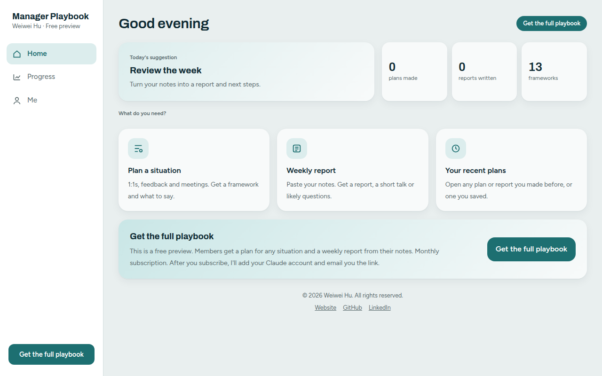
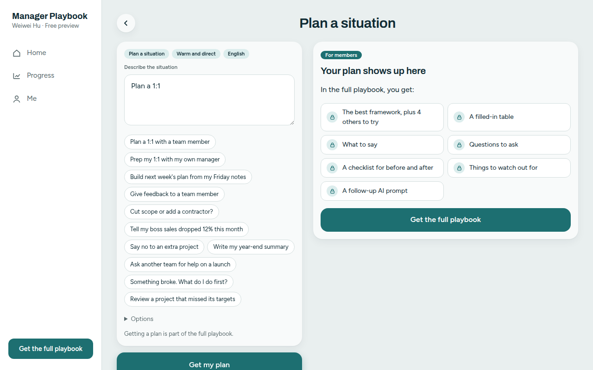
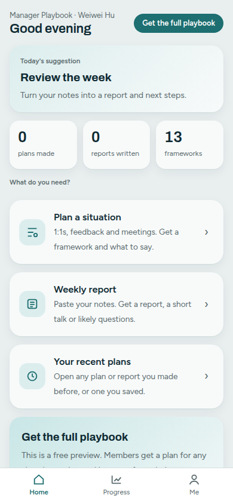

# Manager Playbook

Your AI assistant for everyday manager work, by Weiwei Hu. Tell it what you need and get a plan you can use in minutes.

### [Try the free preview →](https://wei-wei-hu.github.io/manager-playbook/)

It opens in your browser on a phone or laptop. Nothing to install.

## What you get in the full version

- **A practical framework** for your situation, plus others to try
- **What to say** and questions to ask
- **A checklist** for before and after
- **A weekly report** from your notes
- Routines for 1:1s, feedback, meetings, asking another team for help, getting a decision from your boss, handling an urgent problem and project reviews

  
  

## Get the full playbook

The full version is a monthly subscription: [subscribe here](https://buy.stripe.com/cNi14nfzP6RKfkX9F2eQM00). After you subscribe, I'll add your Claude account and email you the link. It runs on your own Claude account.

- Website: https://weiweihu.carrd.co
- LinkedIn: https://www.linkedin.com/in/weiweihu/

© 2026 Weiwei Hu. All rights reserved.
